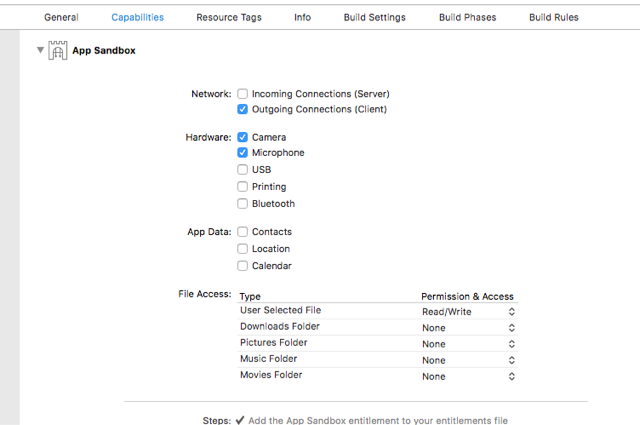

# LFLiveKitMac

Porting LFLiveKit to macOS

---

[](https://raw.githubusercontent.com/KKBOX/LFLiveKitMac/blob/master/LICENSE)&nbsp;
[](http://cocoapods.org/?q=LFLiveKitMac)&nbsp;
[](https://www.apple.com/tw/macos)&nbsp;
&nbsp;


[LFLiveKit](https://github.com/LaiFengiOS/LFLiveKit) is an open source
RTMP streaming SDK for iOS, and the project ports LFLiveKit to macOS.
It helps you to broadcast RTMP streams in your macOS apps.

## Requirements

Currently it is only tested on 

- macOS 10.13 and Xcode 9.1 to 9.2.
- macOS 10.12 and Xcode 8.3. 

However, it should support Xcode 7 and macOS 10.8 and above.

## Usage

Unlike iOS, it is very possible that a mac user has a lot of external
audio and video capture devices connected, such as USB microphones,
webcams and so on. Thus, we change the interface for creating
LFLiveSession objects, specifying a video device and an audio device
is required.

You may have code like this:

``` objective-c
LFLiveAudioConfiguration *audioConfig = [LFLiveAudioConfiguration defaultConfiguration];
LFLiveVideoConfiguration *videoConfig = [LFLiveVideoConfiguration defaultConfigurationForQuality:LFLiveVideoQuality_Medium3];
AVCaptureDevice *audioDevice = [LFLiveSession availableAudioDevices][0];
AVCaptureDevice *videoDevice = [LFLiveSession availableCameraDevices][0];
_session = [[LFLiveSession alloc] initWithAudioConfiguration:audioConfig audioDevice:audioDevice videoConfiguration:videoConfig videoDevice:videoDevice captureType:LFLiveCaptureMaskAll];
_session.delegate = self;
```

## Modification from the Original LFLiveKit

Since APIs differ between iOS and macOS, we need to modify LFLiveKit
to make it able to build and run on macOS. What we did are including

* Change all of the OpenES API calls to corresponding OpenGL ones.
* Change the audio component for audio recording. LFLiveKit uses the
  remoteIO node on iOS, but we need to use kAudioUnitSubType_HALOutput
  on mac OS.
* Change the way that GPUImageFramebuffer generates pixel
  buffer. GPUImageFramebuffer uses an iOS specific texture cache to
  read processed textures and write them into CVPixelBufferRef
  objects. However, the cache does not exist on macOS. We have to use
  another way to create CVPixelBufferRef objects.
* LFHardwareAudioEncoder does not work on macOS, so we always use
  LFH264VideoEncoder.
* Some video filters are removes temporarily in order to make the
  project simpler while doing porting.
* Settings for camera torch and rotation are removed as well, since
  macOS does not support them.

## Notes

### Unable to Access Cameras and Microphones

If you try to obtain camera and audio devices by calling
`[LFLiveSession availableAudioDevices]` and
`[LFLiveSession availableCameraDevices]`, and they return nothing at
all, you might want to check the "Capabilities" tab in Xcode.

Please select your application target in your Xcode project, and
select the second tab "Capabilities". Then, click on the check boxes
of "Hardware: Camera" and "Hardware: Microphone".  You are not able to
access users' hardware until completing the settings.



### Don't Use Power Saving Audio I/O Mode

Apple provides an API, the Audio Power Hint, which helps saving
battery life. Once you want to help users to save more power, you can
set `kAudioHardwarePropertyPowerHint` to
`kAudioHardwarePowerHintFavorSavingPower` by calling
AudioObjectSetPropertyData, or set `AudioHardwarePowerHint` key to
`Favor Saving Power` in your Info.plist file.

Set Audio Power Hint to saving power is great for audio playback, but
it is horrible for recording. When you are in power saving mode, the
I/O buffer size is changed and it may cause what you are recording to
become noises.

For further information about Audio Power Hint, please take a look at
[Technical Note TN2321](https://developer.apple.com/library/content/technotes/tn2321/_index.html).

Enjoy!


## License

 **LFLiveKit is released under the MIT license. See
 [LICENSE](https://github.com/KKBOX/LFLiveKitMac/blob/master/LICENSE) for details.**
